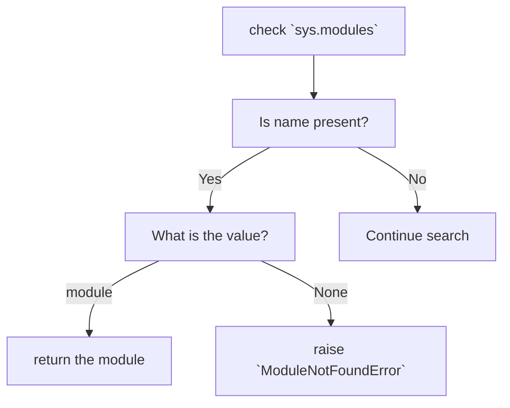

# python-imports
Exploration of the Python import system

# [The import system](https://docs.python.org/3/reference/import.html)

## Import basics

**Importing** - process by which Python code in one module gains access to the code in another module.

There are 3 main ways to perform import:
1. `import` statement - the most common way
```python
>>> import sys
>>> 're' in sys.modules
False
>>> import re
>>> 're' in sys.modules
True
```
2. `importlib.import_module()`
```python
>>> import sys
>>> 're' in sys.modules
False
>>> import importlib
>>> importlib.import_module('re')
<module 're' from '/Library/Developer/CommandLineTools/Library/Frameworks/Python3.framework/Versions/3.8/lib/python3.8/re.py'>
>>> 're' in sys.modules
True
```
3. built-in `__import__()`
```python
>>> import sys
>>> 're' in sys.modules
False
>>> __import__('re', globals(), locals(), [], 0)
<module 're' from '/Library/Developer/CommandLineTools/Library/Frameworks/Python3.framework/Versions/3.8/lib/python3.8/re.py'>
>>> 're' in sys.modules
True
```

Conceptually, we may say that `import` statement performs 2 operations:
1. search for the named module.
2. bind the result to a name in the local scope.

Search operation (1.) is defined as a call to the `___import__()` function. Return value is used to perform the name binding. `sys.modules` is updated as a side-effect, by name binding is performed only by `import` statement. 

Compare `import` statement
``` python
>>> import re
>>> re
<module 're' from '/Library/Developer/CommandLineTools/Library/Frameworks/Python3.framework/Versions/3.8/lib/python3.8/re.py'>
```
with `__import__()` function
```python
>>> __import__('re', globals(), locals(), [], 0)
<module 're' from '/Library/Developer/CommandLineTools/Library/Frameworks/Python3.framework/Versions/3.8/lib/python3.8/re.py'>
>>> re
Traceback (most recent call last):
  File "<stdin>", line 1, in <module>
NameError: name 're' is not defined
```

The second point about binding in the **local scope** can be illustrated with:
```python
>>> def func():
...     print(f'{globals()=}')
...     print(f'{locals()=}')
...     import re
...     print(f'{globals()=}')
...     print(f'{locals()=}')
... 
>>> func()
globals()={'__name__': '__main__', '__doc__': None, '__package__': None, '__loader__': <class '_frozen_importlib.BuiltinImporter'>, '__spec__': None, '__annotations__': {}, '__builtins__': <module 'builtins' (built-in)>, 'func': <function func at 0x104f8c9d0>}
locals()={}
globals()={'__name__': '__main__', '__doc__': None, '__package__': None, '__loader__': <class '_frozen_importlib.BuiltinImporter'>, '__spec__': None, '__annotations__': {}, '__builtins__': <module 'builtins' (built-in)>, 'func': <function func at 0x104f8c9d0>}
locals()={'re': <module 're' from '/Library/Developer/CommandLineTools/Library/Frameworks/Python3.framework/Versions/3.8/lib/python3.8/re.py'>}
>>> re
Traceback (most recent call last):
  File "<stdin>", line 1, in <module>
NameError: name 're' is not defined
```
Only local scope of function `func` is updated with variable `re`. We get a NameError when we try to access `re` from the global scope.

## Packages
Python has only one type of module object, and all modules are of this type, regardless of whether the module is implemented in Python, C, or something else.

Packages roughly correspond to directories and modules to files, but it is not required that they originate in filesystem.

All packages are modules, but not all modules are packages.  
A module that contains a `__path__` attribute is considered a
 package.
 
 ### Regular packages
 Typically implemented as a directory containing an `__init__.py` file. When a regular package is imported, this `__init__.py` file is implicitly executed
 
 ```bash
 parent/
    __init__.py
    one/
        __init__.py
    two/
        __init__.py
    three/
        __init__.py
```

Importing `parent.one` will implicitly execute `parent/__init__.py` and `parent/one/__init__.py`. Subsequent imports of `parent.two` or `parent.three` will execute `parent/two/__init__.py` and `parent/three/__init__.py` respectively.
 
 ### Namespace packages
 It's there and more info [here](https://docs.python.org/3/reference/import.html#namespace-packages)
 
 ## Searching
To begin the search, Python needs the [fully qualified](https://docs.python.org/3/glossary.html#term-qualified-name) name of the module.

### The module cache
The first place checked during import search is `sys.modules`. It serves as a cache of all modules that have been previously imported, including the intermediate paths.
So if `foo.bar.baz` was previously imported, `sys.modules` will contain entries for `foo`, `foo.bar`, and `foo.bar.baz`. Each key will have as its value the corresponding module object.

```python
import sys
import foo.bar.baz

for k,v in sys.modules.items():
    print(k,v)
    
...
foo <module 'foo' from '/Users/marcin/code/python-imports/foo/__init__.py'>
foo.bar <module 'foo.bar' from '/Users/marcin/code/python-imports/foo/bar/__init__.py'>
foo.bar.baz <module 'foo.bar.baz' from '/Users/marcin/code/python-imports/foo/bar/baz/__init__.py'>
```

The import process is as follows:

